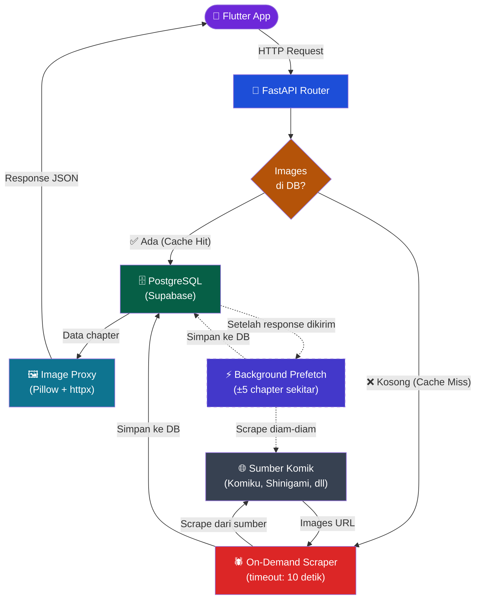

# 📚 TonzToon Komik — Backend API

REST API backend untuk aplikasi mobile pembaca komik **TonzToon**, dibangun dengan **FastAPI** dan dijalankan di atas **Hugging Face Spaces** menggunakan Docker.

## 🛠️ Tech Stack

| Komponen | Teknologi |
|---|---|
| Framework | FastAPI 0.115+ |
| Runtime | Python 3.11 |
| Database | PostgreSQL (via Supabase) |
| ORM | SQLAlchemy 2.0 (async) |
| Auth | Supabase Auth + PyJWT |
| Scraping | Scrapling |
| Image Proxy | Pillow + httpx |
| Container | Docker |

## 🚀 API Endpoints

Dokumentasi interaktif tersedia di:
- **Swagger UI:** `/docs`
- **ReDoc:** `/redoc`

### Endpoint Utama

| Method | Endpoint | Deskripsi |
|---|---|---|
| `GET` | `/api/v1/sources` | Daftar semua source komik |
| `GET` | `/api/v1/sources/{source}/comics` | Katalog komik per source |
| `GET` | `/api/v1/sources/{source}/comics/latest` | Komik terbaru |
| `GET` | `/api/v1/sources/{source}/comics/popular` | Komik populer |
| `GET` | `/api/v1/sources/{source}/comics/{slug}` | Detail komik |
| `GET` | `/api/v1/sources/{source}/comics/{slug}/chapters` | Daftar chapter |
| `GET` | `/api/v1/sources/{source}/comics/{slug}/chapters/{num}` | Isi chapter (dengan lazy load) |
| `GET` | `/api/v1/search?q=...` | Pencarian komik |
| `GET` | `/api/v1/images/proxy` | Proxy gambar (menghindari hotlink protection) |
| `POST` | `/api/v1/scraper/sync` | Trigger sinkronisasi manual via GitHub Actions |

## ⚙️ Environment Variables

Konfigurasi berikut **wajib** diset melalui **Secrets** di Hugging Face Spaces Settings:

| Variable | Deskripsi |
|---|---|
| `DATABASE_URL` | URL koneksi PostgreSQL backend (Supabase) |
| `SUPABASE_URL` | URL project Supabase |
| `SUPABASE_PUBLISHABLE_KEY` | Publishable/Anon key Supabase |
| `SUPABASE_SERVICE_ROLE_KEY` | Service role key Supabase |
| `SUPABASE_COVER_BUCKET` | Nama bucket storage Supabase (misal: thumbnail-comic) |
| `SUPABASE_JWT_AUDIENCE` | Target audience JWT (misal: authenticated) |
| `SUPABASE_JWT_ISSUER` | URL issuer JWT Supabase |
| `SUPABASE_JWT_SECRET` | Secret key untuk validasi JWT |
| `SUPABASE_AUTH_REDIRECT_URL` | URL redirect deep-link untuk konfirmasi email |
| `ADMIN_USER_IDS` | ID user admin (dipisahkan koma) |
| `ALLOW_DEV_USER_HEADER` | Izinkan bypass auth untuk testing (wajib `false` di production) |
| `GITHUB_PAT` | GitHub Personal Access Token (untuk trigger scraper) |
| `GITHUB_REPO_OWNER` | Username/org pemilik repository GitHub |
| `GITHUB_REPO_NAME` | Nama repository GitHub |
| `GITHUB_WORKFLOW_FILE` | Nama file workflow scraper (contoh: `scraper.yml`) |

## 🏗️ Arsitektur



### Fitur Lazy Loading Chapter

Backend ini menggunakan strategi **lazy loading** untuk gambar chapter:
1. **Cache Hit:** Jika gambar sudah ada di database → langsung dikembalikan.
2. **On-Demand Scrape:** Jika gambar belum ada → *live scrape* dari sumber asli (timeout 10 detik).
3. **Background Prefetch:** Setelah chapter dibuka, backend otomatis men-*prefetch* 5 chapter sebelum dan sesudah di latar belakang.

## 🐳 Menjalankan Lokal dengan Docker

```bash
# Build image
docker build -t tonztoon-api .

# Jalankan dengan file .env
docker run -p 7860:7860 --env-file backend/.env tonztoon-api
```

Atau tanpa Docker, langsung menggunakan uvicorn:

```bash
cd backend
pip install -r requirements.txt
uvicorn app.main:app --host 0.0.0.0 --port 8000 --reload
```
