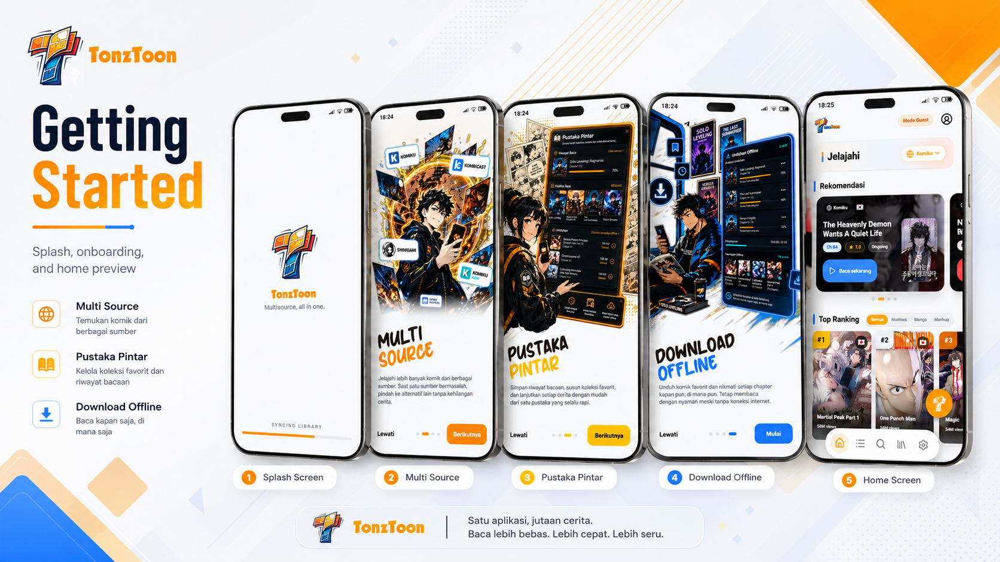
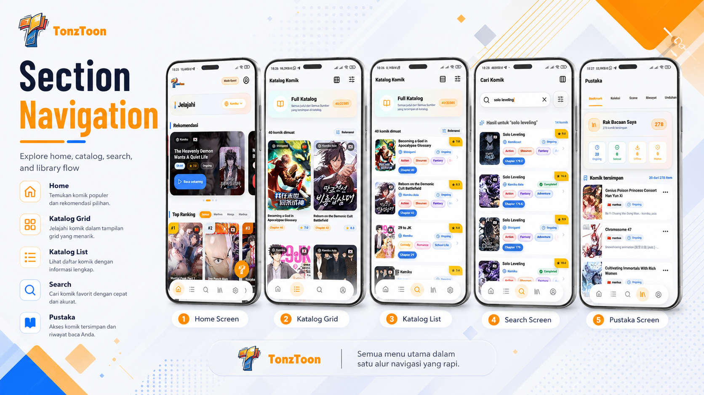
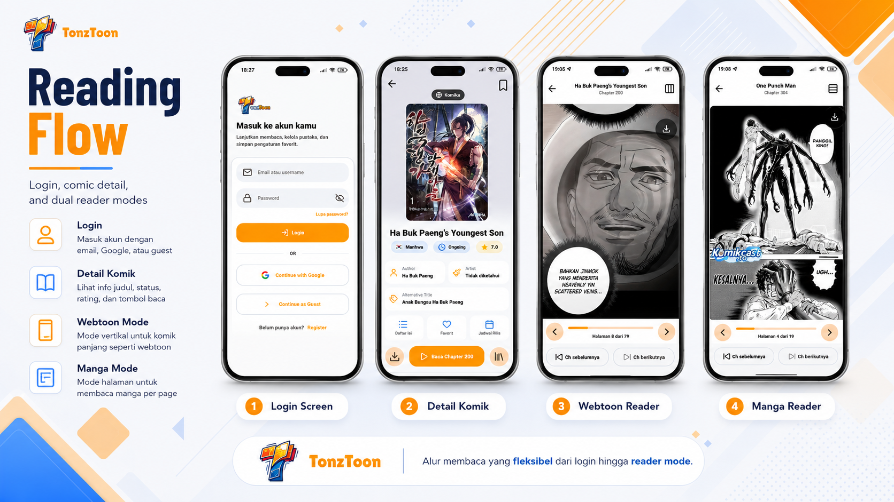

# TonzToon Komik

TonzToon Komik adalah aplikasi baca komik multi-source yang terdiri dari backend FastAPI dan frontend Flutter. Backend menyimpan katalog, chapter, gambar, profil, dan sinkronisasi library di PostgreSQL/Supabase. Frontend menyediakan pengalaman mobile untuk eksplorasi katalog, membaca chapter, continue reading, bookmark, koleksi, favorite scene, riwayat, dan antrean download offline.

## Snapshot Aplikasi

### Getting Started



### Navigasi Utama



### Alur Membaca



## Struktur Repo

```text
tonztoon_komik/
├── backend/      # FastAPI, SQLAlchemy async, Alembic, scraper, API docs
├── frontend/     # Flutter app, Riverpod, GoRouter, Dio, Hive
├── docs/         # Walkthrough arsitektur backend/frontend
├── admin/        # Aset/admin helper untuk operasi proyek
└── README.md     # Ringkasan repo
```

## Tech Stack

| Area | Teknologi |
|---|---|
| Backend API | FastAPI, Uvicorn, Pydantic |
| Database | PostgreSQL/Supabase, SQLAlchemy async, asyncpg, Alembic |
| Auth | Supabase Auth, PyJWT, bearer token |
| Scraper | Scrapling, source registry, script sync CLI |
| Storage | Supabase Storage untuk cover/avatar |
| Frontend | Flutter, Riverpod, GoRouter, Dio |
| Local-first | Hive, Flutter Secure Storage, cached images |
| Notifications/offline | flutter_local_notifications, path_provider, cache manager |

## Backend API

Base path API adalah `/api/v1`. Swagger tersedia di `/docs`, ReDoc di `/redoc`.

Endpoint publik utama:

| Method | Endpoint | Fungsi |
|---|---|---|
| `GET` | `/api/v1/sources` | Daftar source aktif dan statistik katalog |
| `GET` | `/api/v1/comics` | Katalog gabungan semua source dengan filter/sort |
| `GET` | `/api/v1/sources/{source}/comics` | Katalog per source |
| `GET` | `/api/v1/sources/{source}/comics/latest` | Feed terbaru per source |
| `GET` | `/api/v1/sources/{source}/comics/popular` | Feed populer per source |
| `GET` | `/api/v1/sources/{source}/search?q=...` | Search dalam satu source |
| `GET` | `/api/v1/search?q=...` | Search global |
| `GET` | `/api/v1/genres` | Daftar genre |
| `GET` | `/api/v1/genres/{slug}/comics` | Komik berdasarkan genre |
| `GET` | `/api/v1/sources/{source}/comics/{slug}` | Detail komik |
| `GET` | `/api/v1/sources/{source}/comics/{slug}/chapters` | Daftar chapter |
| `GET` | `/api/v1/sources/{source}/comics/{slug}/chapters/{chapter}` | Payload reader, lazy-load gambar jika DB kosong |
| `GET` | `/api/v1/images/proxy?url=...` | Proxy gambar cover/chapter/avatar |

Endpoint auth dan user-scoped:

| Prefix | Fungsi |
|---|---|
| `/api/v1/auth` | Register, login email/password, login Google, refresh, logout, profile, avatar, reset password, security overview |
| `/api/v1/helpdesk` | Submit review/report dari guest atau user login, serta workflow admin untuk memproses laporan |
| `/api/v1/library` | Summary, continue reading, progress, bookmark, collection, favorite scene, history, download intent, reader preferences, reading time, import snapshot guest |
| `/api/v1/account-manager` | Admin-only user manager untuk Supabase Auth dan data aplikasi |
| `/api/v1/scraper/sync` | Trigger GitHub Actions workflow scraper manual |

Endpoint `/library/*`, `/auth/me`, `/auth/profile`, `/auth/security`, dan `/account-manager/*` menggunakan `Authorization: Bearer <supabase_access_token>`. Header `X-User-Id` hanya menjadi fallback lokal jika `ALLOW_DEV_USER_HEADER=true`.

## Menjalankan Backend Lokal

```bash
cd backend
python -m venv venv
venv\Scripts\activate
pip install -r requirements.txt
copy .env.example .env
alembic upgrade head
uvicorn app.main:app --reload
```

Untuk Linux/macOS, gunakan `source venv/bin/activate` dan `cp .env.example .env`.

Environment penting:

| Variable | Fungsi |
|---|---|
| `DATABASE_URL` | URL PostgreSQL async, contoh `postgresql+asyncpg://...` |
| `SUPABASE_URL` | URL project Supabase |
| `SUPABASE_PUBLISHABLE_KEY` | Publishable/anon key Supabase |
| `SUPABASE_SERVICE_ROLE_KEY` | Service role key untuk auth admin/storage |
| `SUPABASE_JWT_AUDIENCE` | Audience JWT, biasanya `authenticated` |
| `SUPABASE_JWT_ISSUER` | Issuer Supabase Auth |
| `SUPABASE_JWT_SECRET` | Opsional untuk legacy HS256 project |
| `SUPABASE_COVER_BUCKET` | Bucket cover komik |
| `SUPABASE_AVATAR_BUCKET` | Bucket avatar user |
| `SUPABASE_AUTH_REDIRECT_URL` | Deep link email confirmation/reset password |
| `ADMIN_USER_IDS` | CSV Supabase user ID yang boleh memakai account manager |
| `ALLOW_DEV_USER_HEADER` | Fallback `X-User-Id` untuk dev lokal, wajib `false` di shared/prod |
| `GITHUB_PAT` dan teman-temannya | Trigger workflow scraper via GitHub API |
| `KOMIKU_ASIA_ACCESS_TOKEN` | Token export akun Komiku Asia untuk helper scraper tertentu |
| `KOMIKU_ASIA_LIVE_SCRAPE_PROVIDER` | Provider lazy/backfill image Komiku Asia: `auto`, `zenrows`, atau `scrapling` |
| `ZENROWS_API_KEY` | API key ZenRows untuk lazy/backfill image Komiku Asia tanpa browser/Xvfb di backend |

## Menjalankan Frontend

```bash
cd frontend
flutter pub get
flutter run --dart-define=API_BASE_URL=http://10.0.2.2:8000/api/v1
```

Gunakan `10.0.2.2` untuk Android emulator, `127.0.0.1` untuk iOS simulator, atau IP LAN mesin backend untuk device fisik. Google Sign-In dapat dikonfigurasi melalui:

```bash
--dart-define=GOOGLE_WEB_CLIENT_ID=...
--dart-define=GOOGLE_IOS_CLIENT_ID=...
```

## Scraper dan Sinkronisasi

Scraper berada di `backend/scraper/` dan memakai registry source. Perintah yang umum dipakai:

```bash
cd backend
python -m scraper.main --source komiku_asia --max-pages 5
python -m scraper.sync_full_library --source komiku_asia --mode validate --start 1 --max 20
python -m scraper.sync_chapter_images --selection random --batch-size 10 --limit 20
python -m scraper.sync_cover_images --limit 500
python -m scraper.check_pending_chapter_images --json-only
```

Chapter reader memakai lazy loading: jika `chapters.images` kosong, backend mencoba mengambil gambar dari source saat endpoint chapter dibuka, menyimpan hasil ke DB, lalu menjadwalkan nearby prefetch di background.

Untuk deploy Hugging Face, lazy/backfill image Komiku Asia dapat dialihkan ke ZenRows dengan `KOMIKU_ASIA_LIVE_SCRAPE_PROVIDER=zenrows` dan `ZENROWS_API_KEY=...`. Mode `auto` juga memakai ZenRows jika API key tersedia, lalu fallback ke Scrapling untuk development lokal.

### Import Environment ke Hugging Face Space

Jika Space perlu dibuat ulang, env/secrets dari `backend/.env-hf` dapat diimport ulang dengan skrip:

```bash
pip install huggingface_hub
python backend/scripts/import_hf_space_env.py --dry-run
python backend/scripts/import_hf_space_env.py
```

Skrip membaca `HF_SPACE` dan `HF_TOKEN` dari `backend/.env-hf`, atau dari environment shell, atau dari argumen `--space`/`--token`. Key internal `HF_SPACE`, `HF_SPACE_ID`, dan `HF_TOKEN` hanya dipakai oleh skrip dan tidak diupload ke Space.

Skrip membaca section `Environment Variables` dan `Secrets Variables` di `backend/.env-hf`. Secara default key yang jelas sensitif, seperti token, secret, dan database URL, tetap dipaksa masuk Secrets walaupun tertulis di section variables. Gunakan `--trust-sections` jika ingin mengikuti section file persis, atau `--all-secrets` jika ingin semua key masuk Secrets.

## Dokumentasi Lanjutan

- [Walkthrough umum](docs/walkthrough.md)
- [Walkthrough backend](docs/walkthrough_backend.md)
- [Walkthrough frontend](docs/walkthrough_frontend.md)
- [Library API contract](backend/docs/library_api_contract.md)
- [Push notification API contract](backend/docs/push_notification_api_contract.md)
- [Flutter-backend integration](backend/docs/flutter_backend_integration.md)
- [Supabase Auth setup](backend/docs/supabase_auth_setup.md)
