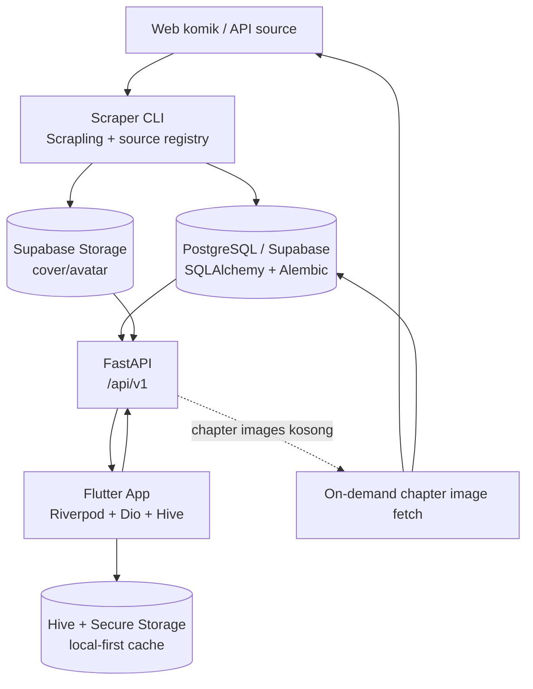

# TonzToon Comic - Codebase Walkthrough

Dokumen ini memberi peta cepat codebase TonzToon Komik berdasarkan struktur saat ini. Untuk detail spesifik, baca juga `docs/walkthrough_backend.md`, `docs/walkthrough_frontend.md`, `backend/docs/library_api_contract.md`, `backend/docs/push_notification_api_contract.md`, dan `backend/docs/flutter_backend_integration.md`.

## 1. Overview

TonzToon Komik adalah aplikasi baca komik multi-source. Backend mengambil dan menyajikan data dari beberapa source komik, sedangkan frontend Flutter menyediakan pengalaman mobile untuk katalog, reader, dan library user.

Fitur utama:

- Katalog gabungan dan katalog per source.
- Feed latest/popular berbasis marker hasil sync scraper.
- Search global dan search per source.
- Detail komik, daftar chapter, dan reader vertical/paged.
- Lazy loading chapter images dari source jika DB belum memiliki daftar gambar.
- Continue reading, history, completed chapters, bookmark, collection, favorite scene, download intent, reader preferences, dan reading time.
- Auth Supabase email/password, Google Sign-In, email verification, reset password, profile/avatar, dan token refresh otomatis.
- Guest/local-first storage dengan migrasi snapshot ke cloud setelah login.

## 2. Arsitektur Tingkat Tinggi



Alur data utamanya:

1. Scraper mengambil metadata komik, chapter, feed latest/popular, cover, dan chapter images.
2. Data disimpan ke PostgreSQL; cover/avatar disimpan atau diproxy lewat backend.
3. Flutter membaca API publik untuk katalog dan reader.
4. Endpoint user-scoped memakai bearer token Supabase.
5. Repository Flutter menyimpan cache lokal supaya guest mode dan pengalaman baca tetap cepat.
6. Saat user login, data guest dapat dikirim ke `/library/sync/import`.

## 3. Struktur Direktori Utama

```text
tonztoon_komik/
├── backend/
│   ├── app/
│   │   ├── api/          # Router FastAPI dan dependency auth
│   │   ├── models/       # Model SQLAlchemy
│   │   ├── schemas/      # Schema Pydantic request/response
│   │   └── services/     # Business logic
│   ├── scraper/          # Source scraper dan script sync
│   ├── alembic/          # Migrasi database
│   ├── docs/             # Kontrak API backend
│   └── scripts/          # Helper operasional
├── frontend/
│   ├── lib/
│   │   ├── main.dart
│   │   └── src/          # Core, features, models, repositories, routing, widgets
│   └── test/
├── docs/
│   ├── walkthrough.md
│   ├── walkthrough_backend.md
│   └── walkthrough_frontend.md
└── README.md
```

## 4. Backend Ringkas

Backend memakai FastAPI dengan prefix `/api/v1` dan router:

- `/comics`: katalog gabungan semua source.
- `/sources`: source list, katalog per source, latest/popular, search per source, detail komik, chapter list, chapter detail.
- `/search`: search global.
- `/genres`: daftar genre dan komik per genre.
- `/images`: proxy gambar.
- `/scraper`: trigger GitHub Actions workflow scraper.
- `/auth`: Supabase Auth, profile, avatar, security, password recovery.
- `/library`: user library, progress, continue reading, downloads, preferences, reading time, import snapshot.
- `/account-manager`: admin-only user management.

Backend memvalidasi Supabase bearer token melalui `app/api/deps.py`. Fallback `X-User-Id` hanya tersedia saat `ALLOW_DEV_USER_HEADER=true`.

Scraper berada di `backend/scraper/` dan memakai registry di `scraper/sources/registry.py`. Source yang tersedia saat ini mencakup implementasi seperti Komiku, Komiku Asia, Komikcast, dan Shinigami, dengan beberapa source memiliki helper API spesifik.

## 5. Frontend Ringkas

Frontend Flutter memakai:

- `flutter_riverpod` untuk state.
- `go_router` untuk routing dan deep link callback auth.
- `dio` untuk API client dan token refresh.
- `hive_flutter` untuk cache lokal.
- `flutter_secure_storage` untuk token.
- `cached_network_image` dan `flutter_cache_manager` untuk gambar.
- `google_sign_in` untuk native Google login.

Feature utama berada di `frontend/lib/src/features/`:

- `auth`: login/register/forgot/reset/callback.
- `home`: home, latest/popular, continue reading preview, section screens.
- `catalog`: katalog penuh.
- `search`: pencarian.
- `comic`: detail komik dan aksi library.
- `reader`: reader vertical/paged dan progress sync.
- `library`: bookmark, collection, scenes, history, downloads.
- `settings`: profile, security, preferences, migration, statistik.
- `notifications`: notifikasi sync/download.

## 6. Menjalankan Lokal

Backend:

```bash
cd backend
python -m venv venv
venv\Scripts\activate
pip install -r requirements.txt
copy .env.example .env
alembic upgrade head
uvicorn app.main:app --reload
```

Frontend:

```bash
cd frontend
flutter pub get
flutter run --dart-define=API_BASE_URL=http://10.0.2.2:8000/api/v1
```

Untuk iOS simulator, ganti base URL menjadi `http://127.0.0.1:8000/api/v1`. Untuk device fisik, gunakan IP LAN mesin backend.

## 7. Script Scraper Umum

```bash
cd backend
python -m scraper.main --source komiku_asia --max-pages 5
python -m scraper.sync_full_library --source komiku_asia --mode validate --start 1 --max 20
python -m scraper.sync_chapter_images --selection random --batch-size 10 --limit 20
python -m scraper.sync_cover_images --limit 500
python -m scraper.check_pending_chapter_images --json-only
```

`/api/v1/scraper/sync` tidak menjalankan scraper berat di proses API. Endpoint itu memicu workflow GitHub Actions memakai konfigurasi `GITHUB_PAT`, `GITHUB_REPO_OWNER`, `GITHUB_REPO_NAME`, dan `GITHUB_WORKFLOW_FILE`.

## 8. Catatan Operasional

- Jangan aktifkan `ALLOW_DEV_USER_HEADER` di environment bersama atau production.
- File offline chapter tetap lokal di device; backend hanya menyimpan download intent/status.
- `chapters.images` disimpan sebagai JSONB untuk menghindari tabel page image yang sangat besar.
- Image URL yang dikirim ke Flutter biasanya sudah lewat proxy backend agar hotlink protection source tidak langsung membebani client.
- Saat endpoint chapter detail menemukan images kosong, backend mencoba lazy fetch, menyimpan hasil, lalu menjadwalkan prefetch chapter sekitar di background.
