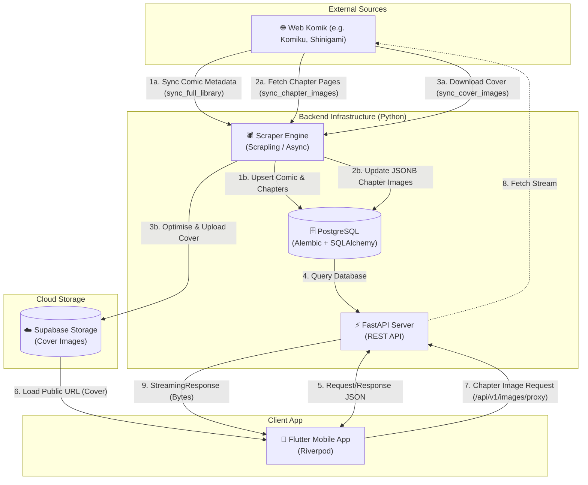
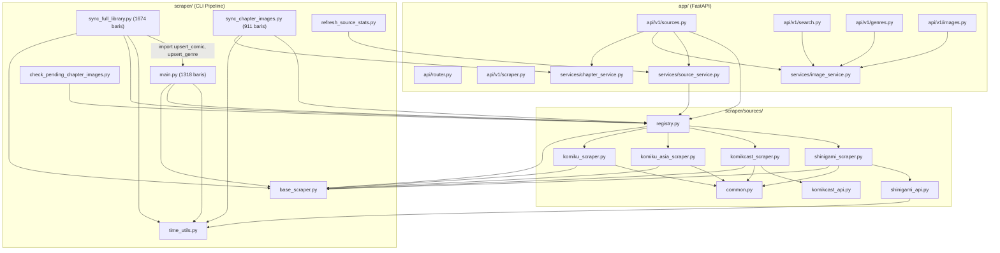

# TonzToon Comic - Codebase Walkthrough

## 1. Overview

TonzToon Comic adalah aplikasi mobile baca komik (Manga, Manhwa, Manhua) lintas sumber (Multi-Source). Aplikasi ini dibangun dengan arsitektur modern yang memisahkan antara _Frontend_ (Mobile App) dan _Backend_ (API & Scraper).

Aplikasi ini mengutamakan kecepatan akses, fitur _Continue Reading_, sinkronisasi _Cloud_ via Supabase, pembaca komik yang nyaman (Manga mode & Webtoon mode), serta dukungan _Offline Download_.

### Arsitektur Tingkat Tinggi

Secara keseluruhan, siklus hidup data pada aplikasi ini diilustrasikan melalui diagram berikut:



## 2. Struktur Direktori Utama

Codebase dibagi menjadi dua komponen utama: `backend` dan `frontend`.

```text
tonztoon_komik/
├── backend/            # Python FastAPI backend & Scraper
├── frontend/           # Flutter mobile application
├── prd_tonztoon.md     # Product Requirements Document
└── walkthrough.md      # Dokumen ini
```

---

## 3. Backend (Python / FastAPI)

Backend berfungsi sebagai penyedia REST API untuk aplikasi mobile dan juga memiliki modul Scraper yang berjalan di latar belakang untuk melakukan sinkronisasi data komik dari berbagai sumber.

**Tech Stack Utama:**

- **Framework:** FastAPI
- **Database:** PostgreSQL (Alembic untuk migrasi, SQLAlchemy/asyncpg untuk ORM)
- **Scraping:** Scrapling
- **Auth:** PyJWT & integrasi Supabase Auth

### Struktur Direktori `backend/`

- `app/`: Berisi inti aplikasi FastAPI.
  - `api/v1/`: Endpoint REST API (auth, genres, images, library, scraper, search, sources).
  - `models/`: Definisi skema database SQLAlchemy.
  - `schemas/`: Pydantic models untuk validasi request/response.
  - `services/`: Business logic dan interaksi dengan database.
  - `config.py`: Pengaturan variabel lingkungan.
  - `database.py`: Konfigurasi koneksi database.
  - `main.py`: Entry point server FastAPI.
- `scraper/`: Modul independen untuk scraping data dari web komik.
  - `sources/`: Berisi implementasi spesifik per website (Komikcast, Komiku, Komiku Asia, Shinigami). Terdapat scraper berbasis HTML maupun API (untuk sumber yang menyediakan endpoint API mandiri).
  - `sync_*.py`: Script sinkronisasi yang biasanya dijalankan secara berkala (cron/background task) seperti `sync_chapter_images.py`, `sync_cover_images.py`, dan `sync_full_library.py`.
- `alembic/` & `alembic.ini`: Konfigurasi migrasi skema database.
- `requirements.txt`: Daftar dependensi Python.

### Peta Dependensi Internal Backend (SoC)

Secara internal, struktur dari modul scraper saling bergantung melalui sebuah _Factory/Registry Pattern_ untuk mencegah _circular dependency_ yang berlebihan antara skrip pengeksekusi dengan sumber scraper.



---

## 4. Frontend (Flutter)

Frontend adalah aplikasi mobile native yang berinteraksi dengan API dari backend. Aplikasi dirancang agar cepat (menggunakan cache) dan mendukung mode _offline-first_.

**Tech Stack Utama:**

- **State Management:** Riverpod (`flutter_riverpod`)
- **Routing:** Go Router (`go_router`)
- **Networking:** Dio (`dio`)
- **Local Storage/Cache:** Hive (`hive_flutter`) & Flutter Secure Storage
- **Image Handling:** Cached Network Image (`cached_network_image`)

### Struktur Direktori `frontend/lib/`

- `main.dart`: Entry point aplikasi Flutter.
- `src/`: Berisi source code utama aplikasi.
  - `app.dart`: Konfigurasi root widget dan inisialisasi theme/router.
  - `core/`: Utilitas, konfigurasi tema, HTTP client (Dio), error handling, dan konstanta global.
  - `features/`: Fitur-fitur utama aplikasi dengan struktur modular:
    - `auth/`: Autentikasi pengguna (Guest & Login).
    - `comic/`: Menampilkan detail komik, metadata, dan daftar chapter.
    - `home/`: Tampilan layar utama (Discover, Continue Reading, Trending).
    - `reader/`: Pembaca komik inti dengan mode Vertical & Paged (Manga Mode).
    - `library/`: (Berada di `shell` atau terpisah) Koleksi komik, bookmark, history, dan unduhan.
    - `search/` / `shell/` / `splash/` / `onboarding/`: Fitur penunjang UI & navigasi.
  - `models/`: Definisi struktur data (Dart classes) hasil parsing API.
  - `repositories/`: Lapisan abstraksi untuk mengambil data dari network (API) maupun lokal (Hive).
  - `routing/`: Konfigurasi rute menggunakan GoRouter.
  - `widgets/`: Komponen UI yang dapat digunakan kembali secara global (Shared UI components).

---

## 5. Alur Kerja & Eksekusi

### Backend

1. **Menjalankan Server API:**
   Bisa dilakukan dengan perintah uvicorn standar.
   ```bash
   cd backend
   uvicorn app.main:app --reload
   ```
2. **Menjalankan Script Scraper:**
   Modul scraper dapat dijalankan secara terpisah dari server utama sebagai task _batch_ atau terminal process.
   ```bash
   cd backend
   python -m scraper.sync_cover_images --limit 500
   python -m scraper.sync_full_library
   ```

### Frontend

1. **Setup & Dependencies:**
   ```bash
   cd frontend
   flutter pub get
   ```
2. **Menjalankan Aplikasi:**
   ```bash
   flutter run
   ```
   Atau menggunakan tombol Run/Debug pada IDE.

---

## Catatan Penting

- **Background Task:** Saat ini ada task sinkronisasi (seperti `sync_cover_images`) yang sesekali mengalami _time-out_ atau koneksi terputus ke resource Supabase/Storage. Hal ini memerlukan pengecekan cooldown / validasi koneksi di scraper utils.
- **Offline First:** Pastikan untuk menjaga _Source of Truth_ di Hive (lokal) untuk pengguna Guest dan sinkronisasi ke PostgreSQL (via API) setelah melakukan proses Login, sesuai spesifikasi pada dokumen `prd_tonztoon.md`.
