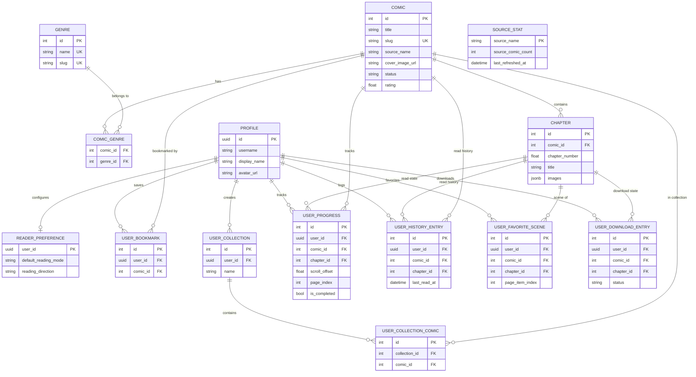

# TonzToon Comic - Backend Walkthrough

## 1. Ikhtisar (Overview)
Bagian backend dari TonzToon Comic dibangun dengan **Python 3** menggunakan framework **FastAPI**. Backend ini dirancang dengan dua tanggung jawab utama:
1. **REST API Server**: Menyediakan endpoint API untuk konsumsi aplikasi mobile (Flutter), menangani request seperti data komik, sinkronisasi *library*, pencarian, dan autentikasi.
2. **Scraping Engine**: Modul independen (`scraper`) yang berjalan untuk mengekstrak data dari web komik pihak ketiga dan menyimpannya ke database.

## 2. Arsitektur Perangkat Lunak (Software Architecture)
Backend ini mengimplementasikan pemisahan tanggung jawab (*Separation of Concerns*) yang ketat dengan kombinasi beberapa pola arsitektur utama:
- **Layered Architecture (N-Tier)**: Komponen REST API dipecah menjadi *Router Layer* (`app/api` untuk *routing* dan validasi *request*), *Service/Business Logic Layer* (`app/services` untuk logika bisnis dan kueri ORM), dan *Data Access Layer* (`app/models` untuk skema database, `app/schemas` untuk validasi tipe data Pydantic).
- **Factory & Registry Pattern**: Sangat ditekankan pada komponen `scraper/`. Daripada menggunakan *if-else* masif untuk menentukan skrip komik mana yang harus berjalan, sistem secara dinamis mendaftarkan (*register*) dan menginisiasi implementasi *scraper* (*factory*) berdasarkan parameter *source string* (misal: "komikcast").
- **Asynchronous I/O Pattern**: Menggunakan eksekusi *non-blocking* `async/await` dari ujung ke ujung. *Library* seperti `asyncpg` untuk koneksi database dan `Scrapling` untuk permintaan *HTTP fetching* beroperasi sepenuhnya asinkron agar penggunaan CPU dan *Memory* tetap efisien saat menahan ratusan koneksi secara konkuren.
- **Offline-First / Background Job Pattern**: Memisahkan operasi *web-scraping* yang memakan waktu lama ke dalam skrip *headless CLI* independen (Cron Jobs). Endpoint API hanya mengambil data yang sudah rapi di database, tidak pernah meminta aplikasi FastAPI untuk melakukan *scraping* secara langsung secara *real-time*.

### 2.1. Keputusan Desain & Optimasi Sistem
Selain pola arsitektur utama di atas, backend ini juga mengimplementasikan keputusan desain (*Design Decisions*) spesifik untuk efisiensi dan keamanan:
- **DRY Principle (Don't Repeat Yourself)**: Modul *scraper* tidak memiliki skema/model tersendiri. Ia langsung mengimpor entitas dari `app.models` dan memvalidasi datanya menggunakan `app.schemas`. Hal ini menjamin konsistensi struktur data dari tahap *scraping* hingga ke klien API.
- **JSONB untuk Data Gambar**: Alih-alih membuat tabel relasional terpisah untuk menyimpan jutaan daftar URL gambar per bab, daftar *image links* disimpan sebagai *array* di dalam kolom tipe data **JSONB** pada tabel `chapters`. Pendekatan ini secara drastis mengurangi *overhead join* dan lebih efisien saat di-kueri.
- **Image Proxy dengan StreamingResponse**: Saat API mem-proksi gambar dari server pihak ketiga (untuk menghindari isu pemblokiran referer), *bytes* gambar dialirkan (di-*stream*) secara langsung ke klien menggunakan `StreamingResponse`. Backend tidak perlu menunggu seluruh gambar masuk ke *buffer RAM* (yang bisa memicu kebocoran memori).
- **Eksekusi Terdistribusi (workflow_dispatch)**: Untuk tugas sinkronisasi *manual*, alih-alih mengeksekusi proses *scraping* yang berat langsung di mesin/server *backend*, *backend* hanya memicu (*trigger*) *GitHub Actions API* secara jarak jauh untuk mengambil alih tugas *scraping* tersebut (menghemat *resource server* lokal).
- **Keamanan Kredensial**: Tidak ada *hardcoded token*. *Personal Access Token (PAT)* GitHub, URL Database, dan *JWT Secret* disimpan secara ketat di *environment variables* (`.env`).
- **PostgreSQL Async (asyncpg)**: Seluruh lapisan database dikonfigurasikan dengan engine `asyncpg` via SQLAlchemy untuk menjamin tidak ada satupun *request* I/O yang memblokir jalannya *event-loop* Python.

### 2.2. Struktur Database (Entity Relationship Diagram)
Sebagai visualisasi dari entitas yang dibangun oleh SQLAlchemy, berikut adalah pemetaan struktur *database* yang digunakan:



## 3. Tech Stack & Dependensi Utama
- **FastAPI** (`fastapi[standard]`): Web framework berkinerja tinggi untuk membangun API.
- **Uvicorn** (`uvicorn[standard]`): ASGI web server untuk menjalankan FastAPI.
- **Database (PostgreSQL)**:
  - **SQLAlchemy** (`sqlalchemy[asyncio]`): ORM asinkron untuk berinteraksi dengan PostgreSQL.
  - **Asyncpg** (`asyncpg`): Driver database PostgreSQL berkinerja tinggi.
  - **Alembic** (`alembic`): Tool untuk migrasi skema database.
- **Scraping**: **Scrapling** (`scrapling[all]`).
- **Autentikasi**: **PyJWT** (`PyJWT[crypto]`) untuk memvalidasi token JWT dari Supabase Auth.
- **Data Validation**: **Pydantic** (`pydantic`, `pydantic-settings`).

## 4. Struktur Direktori `backend/`
```text
backend/
├── alembic/              # File dan versi migrasi database SQLAlchemy
├── app/                  # Direktori utama untuk REST API FastAPI
│   ├── api/v1/           # Endpoint-endpoint API, dipisah berdasarkan modul
│   │   ├── auth.py
│   │   ├── genres.py
│   │   ├── images.py
│   │   ├── library.py
│   │   ├── scraper.py
│   │   ├── search.py
│   │   └── sources.py
│   ├── models/           # Model-model SQLAlchemy (Skema Tabel)
│   ├── schemas/          # Model-model Pydantic (Validasi Request/Response)
│   ├── services/         # Business logic dan query database
│   ├── config.py         # Konfigurasi aplikasi dari environment (.env)
│   ├── database.py       # Setup koneksi database engine & session
│   └── main.py           # Entry point untuk aplikasi FastAPI
├── data/                 # Penyimpanan file data lokal sementara/checkpoint
├── scraper/              # Direktori mesin web scraping
│   ├── sources/          # Implementasi spesifik per situs target (Komikcast, Shinigami, dll.)
│   │   ├── common.py     # Fungsi-fungsi utilitas untuk scraper (ScraperCommonMixin)
│   │   └── [source_name]_scraper.py
│   ├── sync_*.py         # Script task sinkronisasi (cron-like job)
│   │   ├── sync_chapter_images.py
│   │   ├── sync_cover_images.py
│   │   └── sync_full_library.py
│   └── utils.py          # Helper function umum untuk scraping
├── .env                  # Konfigurasi rahasia dan kredensial (database url, jwt secret)
├── alembic.ini           # File konfigurasi utama untuk Alembic
└── requirements.txt      # Daftar dependensi package Python
```

## 5. Alur Kerja Komponen
### 5.1. Arsitektur & Proses Scraping Data (Data Ingestion)
Modul scraper bertugas mengumpulkan data komik, chapter, dan gambar dari berbagai sumber. Modul ini dirancang agar mudah diperluas (*scalable*) dengan arsitektur *Registry Pattern* dan menggunakan library `Scrapling` sebagai *engine* utamanya.

**Komponen Utama Scraper:**
- **Base Scraper (`base_scraper.py`)**: Kelas abstrak dasar (`BaseComicScraper`) yang mendefinisikan *interface* standar wajib untuk setiap scraper sumber, seperti fungsi `search_comics`, `get_latest_comics`, `get_comic_details`, dan `get_chapter_images`.
- **Scraper Sources (`sources/`)**: Implementasi spesifik logika scraping untuk setiap situs web (misalnya `komiku_scraper.py`, `komikcast_scraper.py`, `shinigami_scraper.py`, `komiku_asia_scraper.py`). Tiap kelas mewarisi `BaseComicScraper` dan dapat memiliki metode spesifik (seperti API mandiri `shinigami_api.py` / `komikcast_api.py`).
- **Common Mixin (`common.py`)**: Kelas utilitas (`ScraperCommonMixin`) yang menyediakan fungsi bantuan untuk parsing HTML, pembersihan teks, resolusi URL absolut (mengelola *relative path*), dan normalisasi field metadata yang umum digunakan lintas scraper.
- **Registry (`registry.py`)**: Bertindak sebagai *Factory* dan *Registry* sentral yang mendaftarkan dan mengeksekusi inisialisasi instance dari masing-masing kelas scraper secara dinamis berdasarkan identifier sumbernya (misal: "komiku", "shinigami").
- **Skrip Sinkronisasi (`sync_*.py`)**: Skrip mandiri yang menjalankan tugas operasi latar belakang (*batch process*):
  - `sync_full_library.py`: Mensinkronisasikan daftar komik populer/terbaru, memindai dan menambah komik baru, serta memperbarui bab (*chapter*) komik yang sudah ada dari semua sumber yang terdaftar.
  - `sync_cover_images.py`: Bertugas secara khusus mengunduh dan menyimpan gambar sampul (*cover*) komik ke *local storage* atau *cloud bucket* untuk meminimalisasi eksploitasi *hotlinking* sumber aslinya.
  - `sync_chapter_images.py`: Sinkronisasi ekstraksi daftar URL halaman gambar di dalam suatu spesifik bab (*chapter*).
  - `check_pending_chapter_images.py`: Memeriksa dan mencoba ulang proses pemindaian bab komik yang gagal/terhenti pada proses sinkronisasi sebelumnya.

**Mekanisme Fetching dengan Scrapling:**
Sistem scraper mengandalkan modul `Scrapling` dengan menerapkan **strategi hybrid** yang memadukan tiga pendekatan utama sesuai kebutuhan:

| Fetcher Type | Use Case Utama | Level Anti-bot | Kecepatan |
|---|---|---|---|
| **`Fetcher`** | Halaman daftar komik statis (listing HTML murni tanpa JS). | ❌ Basic | ⚡ Tercepat |
| **`DynamicFetcher`** | Halaman yang bergantung pada *lazy-loading* / di-render penuh oleh JS. | ⚠️ Medium | 🔄 Medium |
| **`StealthyFetcher`** | Halaman terlindungi (Cloudflare / proteksi anti-bot kuat). | ✅ Full Stealth | 🐢 Lambat |

Pendekatan hybrid ini dipakai secara kontekstual: misal, menggunakan `Fetcher` standar untuk mengambil direktori halaman komik dengan super cepat, namun otomatis beralih ke `DynamicSession` (menggunakan Playwright `wait_selector`) secara spesifik untuk mem-bypass dan membaca laman bab komik yang memiliki *infinite scroll* atau dirender via AJAX.

**Alur Kerja Ekstraksi & Penyimpanan:**
1. Skrip sinkronisasi atau endpoint API (`/api/v1/scraper`) memanggil *instance* scraper spesifik melalui `ScraperRegistry`.
2. Scraper mengambil halaman (*fetch*) HTML atau JSON dari sumber tujuan dengan *rate-limiting/cooldown* untuk mencegah pemblokiran IP.
3. HTML di-*parsing* menjadi struktur data menggunakan selektor CSS/XPath.
4. Nilai-nilai string kotor (seperti nama *author* dengan label berlebih) dibersihkan dengan utilitas dari `ScraperCommonMixin`.
5. Data divalidasi dengan model Pydantic (`ComicCreate`, `ChapterCreate`, dll). Jika ada batas karakter yang terlampaui (misalnya deskripsi melebihi 300 karakter), data akan ditangani atau dipangkas (truncate) sesuai regulasi schema untuk menghindari *Pydantic Validation Error*.
6. Data final yang telah bersih dan tervalidasi kemudian dimasukkan ke database PostgreSQL melalui operasi `upsert` pada layer `app.services` menggunakan SQLAlchemy ORM.

### 5.2. Proses REST API (Data Consumption)
- Saat aplikasi Flutter membutuhkan data, ia mengirim request HTTP ke endpoint `/api/v1/`.
- Router FastAPI (`app/api/v1/`) menerima request, jika endpoint butuh login, token Supabase divalidasi dengan middleware PyJWT di `auth.py`.
- Router kemudian memanggil fungsi di layer `services/` yang berinteraksi secara asinkron (menggunakan `asyncpg` via `sqlalchemy`) dengan PostgreSQL.
- Hasil dari DB divalidasi kembali dan di-format sesuai skema Pydantic (`schemas/`) sebelum dikembalikan sebagai respon JSON ke klien.

### 5.3. Lifecycle Aplikasi & Manajemen State
Mengingat backend ini menangani dua jenis pemrosesan yang sangat berbeda (pelayanan klien secara real-time via API dan pemrosesan latar belakang via Scraper), penting untuk memahami *lifecycle* masing-masing komponen:

**A. Lifecycle FastAPI (Pelayanan REST API)**
1. **Startup (`app/main.py`)**: Saat *server* Uvicorn dijalankan, FastAPI memicu *startup event*. Hal terpenting yang terjadi di sini adalah inisialisasi SQLAlchemy *Connection Pool* asinkron melalui `database.py`. Pool ini disiapkan untuk melayani banyak *request* ke database secara konkuren.
2. **Request Masuk**: Setiap *request* HTTP dari klien akan melalui *Middleware* (seperti konfigurasi CORS). Jika *request* menuju rute terproteksi (profil pengguna, favorit), maka *Dependency Injection* `verify_token` di `auth.py` dieksekusi terlebih dulu untuk membedah *header Bearer* (JWT Supabase).
3. **Session Allocation**: FastAPI menggunakan metode *Dependency Injection* `get_db()` yang secara dinamis membuka sesi (*database session*) baru dari *pool*.
4. **Eksekusi Business Logic & Validasi**: *Controller/Router* memanggil layer `services/`, mengeksekusi operasi ORM dengan *session* yang diberikan, lalu memvalidasi *output* melalui Pydantic schemas.
5. **Teardown**: Setelah respons berhasil dikembalikan ke klien, *Dependency Injection* `get_db()` akan secara otomatis menutup sesi (melakukan `commit` atau `rollback` jika terjadi galat), mengembalikan koneksi tersebut ke *pool*.

**B. Lifecycle Scraper (Background Jobs)**
1. **Inisialisasi**: Saat skrip *scraper* (misal: `python -m scraper.main`) dipanggil oleh terminal atau GitHub Actions, eksekusi Python dimulai dengan membangun konteks *database session* miliknya sendiri, terpisah dari FastAPI *pool*.
2. **Registry Bootstrap**: Kelas scraper yang dituju dipanggil melalui *Registry* dinamis dan *HTTP client* asinkron (misal: Scrapling `DynamicSession`) diaktifkan.
3. **Data Polling & Checkpoint**: Skrip akan selalu melihat *checkpoint/state file* lokal (berada di direktori `data/`) untuk menentukan posisi kelanjutan data sebelumnya guna menghindari pekerjaan ganda (resume).
4. **Database Transaction (Per-Item)**: Tidak seperti operasi *batch* yang mengunci tabel, scraper umumnya dirancang untuk memasukkan (*upsert*) data komik/bab secara per-item untuk mencegah masalah kebuntuan memori (*memory bloat*). Operasi ini disertai manajemen *cooldown* / *delay* acak.
5. **Graceful Shutdown**: Skrip scraper dipasangi mekanisme `GracefulShutdown` untuk menangkap sinyal terminasi sistem operasi (seperti `SIGINT`/`Ctrl+C`). Jika pengguna menghentikan skrip di tengah jalan, *scraper* akan merampungkan transaksi *database* pada item yang sedang diproses, menyimpan *checkpoint* progres terakhir secara aman, lalu menutup sesi *browser headless* sebelum aplikasi benar-benar dimatikan.

## 6. Panduan Menjalankan & Mengembangkan
1. **Instalasi Lingkungan & Dependensi:**
   Disarankan menggunakan *virtual environment* (venv).
   ```bash
   cd backend
   python -m venv venv
   source venv/bin/activate  # Untuk Linux/Mac
   # venv\Scripts\activate   # Untuk Windows
   pip install -r requirements.txt
   ```
2. **Konfigurasi Environment (.env):**
   Salin berkas contoh `.env` dan lengkapi kredensialnya.
   ```bash
   cp .env.example .env
   # Buka berkas .env dan isikan DATABASE_URL, SUPABASE_JWT_SECRET, GITHUB_PAT, dsb.
   ```
3. **Menyiapkan Database PostgreSQL:**
   Pastikan *service* PostgreSQL sudah berjalan di sistem Anda. Buat database baru untuk proyek ini (bisa menggunakan antarmuka psql atau pgAdmin):
   ```sql
   CREATE DATABASE tonztoon_komik;
   ```
4. **Mengelola Migrasi Database (Alembic):**
   Alembic digunakan untuk melacak dan mengaplikasikan perubahan skema pada database PostgreSQL (berdasarkan model SQLAlchemy di `app/models/`). Pastikan kredensial database di `.env` sudah benar.
   *(Catatan: Anda **tidak perlu** menjalankan `alembic init alembic` karena direktori konfigurasi `alembic/` dan `alembic.ini` sudah tersedia di dalam repositori ini).*
   
   Berikut adalah daftar perintah Alembic yang paling sering digunakan:
   
   ```bash
   # 1. Mengaplikasikan semua migrasi yang belum dijalankan ke database (Paling Sering Digunakan)
   alembic upgrade head
   
   # 2. Membuat file migrasi baru secara otomatis (Jalankan setelah mengubah kode di app/models/)
   alembic revision --autogenerate -m "Pesan deskripsi perubahan Anda"
   
   # 3. Membatalkan (rollback) migrasi 1 tingkat ke versi sebelumnya
   alembic downgrade -1
   
   # 4. Membatalkan semua migrasi hingga ke kondisi awal (kosong)
   alembic downgrade base
   
   # 5. Melihat riwayat (history) dan versi skema migrasi yang ada
   alembic history --verbose
   ```
5. **Menjalankan Server API:**
   ```bash
   uvicorn app.main:app --reload
   ```
   API docs interaktif akan otomatis tersedia di `http://127.0.0.1:8000/docs` (Swagger UI).
6. **Menjalankan Sinkronisasi (Scraping):**
   Modul scraper mendukung eksekusi via Command Line Interface (CLI) dengan beberapa *flag* atau argumen. Berikut adalah daftar perintah utama yang dapat digunakan:

   - **Entry Point Utama & Cron Jobs (`scraper/main.py`):**
     Skrip ini adalah *entry point* operasional utama yang dirancang khusus untuk pembaruan rutin dan eksekusi otomatis (seperti via *GitHub Actions Cron Job*). Fungsi paling fundamental dari skrip ini adalah untuk melakukan *scrape* pada daftar **Latest Updates** (Pembaruan Terbaru) dan **Popular Comics** (Komik Populer) langsung dari sumber aslinya agar selalu tersinkronisasi. Skrip ini tidak sekadar menarik data biasa, tetapi memiliki alur kerja cerdas:
     - **Penyelarasan Latest & Popular (Feed Sync)**: Memindai halaman "Terbaru" dan "Populer" dari situs web target, mencatat posisi/peringkat (feed marker) tiap komik, agar endpoint API backend mampu mengembalikan daftar ranking yang representatif layaknya situs asli.
     - **Incremental Sync & Early-Stop**: Saat memindai daftar pembaruan terbaru, proses pencarian akan otomatis berhenti (*early-stop*) jika skrip mulai mencapai komik/chapter yang sudah tercatat di database (unchanged), menghemat waktu dan beban *resource*.
     - **Pre-warming Cache (Hybrid)**: Mengunduh gambar (*images*) secara proaktif hanya untuk beberapa bab (*chapter*) terbaru saja untuk mencegah *server overload* (*Thundering Herd*), sedangkan bab-bab lama dibiarkan hanya berupa metadata dan akan dimuat nanti via *lazy loading* saat dibaca user.
     - **Anti-Blocking**: Menerapkan jeda (*delay/backoff*) acak antar permintaan untuk mencegah pemblokiran IP oleh peladen sumber.
     
     **Parameter Argumen:**
     *   `--source <name>`: Menentukan sumber target secara spesifik (misal: `komiku`, `komikcast`). Jika tidak diisi, skrip memproses semua sumber.
     *   `--max-pages <N>`: Menentukan jumlah maksimum halaman *Latest Updates* yang akan dipindai. Gunakan `0` untuk menonaktifkannya.
     *   `--popular-pages <N>`: Menentukan jumlah maksimum halaman *Popular Comics* yang akan dipindai. Gunakan `0` untuk menonaktifkannya.
     *   `--popular-no-early-stop`: Menonaktifkan mekanisme *early-stop* saat memindai komik populer. Memungkinkan pemindaian hingga halaman terdalam tanpa berhenti meskipun komik sudah tersimpan di database.
     *   `--log-file <path>`: Menyimpan output log ke file khusus.

     Berikut adalah contoh penggunaan eksekusi dengan argumen CLI-nya:
     ```bash
     # Sinkronisasi otomatis menggunakan parameter default (mengambil dari semua source)
     python -m scraper.main
     
     # Cron harian ringan khusus satu source, memindai maksimum 5 halaman "Latest"
     python -m scraper.main --source komiku_asia --max-pages 5
     
     # Hanya melakukan pembaruan pada halaman "Popular" saja (matikan "Latest" dengan max-pages 0)
     python -m scraper.main --max-pages 0 --popular-pages 5
     
     # Menyapu halaman "Popular" lebih dalam tanpa menggunakan mekanisme 'early-stop'
     # (Sangat cocok saat onboarding source baru untuk menyerap data lebih mendalam)
     python -m scraper.main --source komikcast --popular-pages 8 --popular-no-early-stop
     ```

   - **Sinkronisasi Library Spesifik (Katalog & Detail Komik) (`scraper/sync_full_library.py`):**
     Menjalankan proses pengambilan data katalog komik secara masif. Skrip ini biasanya dipakai untuk *seeding* katalog baru atau melakukan *refresh* menyeluruh terhadap detail metadata dan bab (*chapter*).
     **Parameter Argumen:**
     *   `--source <name>`: Filter sinkronisasi untuk sumber tertentu saja.
     *   `--mode <validate|refresh>`: `validate` (default) akan melewati komik yang sudah ter-*scrape* penuh (lebih cepat), sedangkan `refresh` akan memaksa sinkronisasi ulang semuanya.
     *   `--refresh-fields <field_list>`: Daftar spesifik kolom metadata yang ingin di-patch (misal: `rating,total_view`) saat menggunakan mode `validate`, untuk menghindari sinkronisasi chapter besar-besaran.
     *   `--start <page>`: Menentukan halaman awal paginasi direktori yang ingin diproses.
     *   `--max <N>`: Membatasi maksimal jumlah halaman yang akan diproses sejak `--start`.
     *   `--end <page>`: Menentukan halaman akhir eksplisit untuk diproses (mengabaikan `--max`).
     *   `--reset`: Menghapus checkpoint lama agar sinkronisasi dimulai dari awal murni tanpa resume.
     *   `--log-file <path>`: Menyimpan output log ke file khusus.

     Contoh penggunaan eksekusi dengan argumen CLI-nya:
     ```bash
     # Mode 'validate' (default): Memeriksa halaman katalog, memasukkan komik yang belum ada.
     # Komik yang sudah ada akan dilewati proses sinkronisasi detail/chapter penuhnya, menghemat waktu.
     # Contoh: Memulai proses dari halaman 1, ambil hingga maksimal 20 halaman dari source komiku_asia
     python -m scraper.sync_full_library --source komiku_asia --mode validate --start 1 --max 20
     
     # Mode 'refresh': Memaksa sinkronisasi ulang secara penuh (metadata dan chapter) 
     # meskipun komik sudah pernah di-scrape sebelumnya. Ini operasi berat.
     # Contoh: Mengulang sync penuh halaman 10 sampai 12 untuk komikcast.
     python -m scraper.sync_full_library --source komikcast --mode refresh --start 10 --end 12
     
     # Mode patch (refresh-fields): Memperbarui subset kolom metadata ringan tanpa harus
     # memicu sinkronisasi chapter secara utuh. Sangat berguna untuk update 'rating'/'view'.
     python -m scraper.sync_full_library --source shinigami --mode validate --refresh-fields total_view,rating,status
     ```

   - **Sinkronisasi Gambar Sampul (Cover) (`scraper/sync_cover_images.py`):**
     Mengunduh *cover* komik yang metadata-nya sudah tersimpan namun gambarnya belum di-cache secara lokal (menghindari koneksi langsung ke sumber eksternal terus-menerus dan memperbaiki performa front-end).
     **Parameter Argumen:**
     *   `--source <name>`: Batasi unduhan *cover* dari sumber tertentu.
     *   `--limit <N>`: Batas maksimal *cover* yang diunduh pada proses berjalannya skrip (membantu untuk menghindari blokir karena permintaan berlebihan).
     *   `--force`: Memaksa mengunduh ulang gambar *cover* komik dari server meskipun berkas lokalnya sudah ada (berguna jika terjadi masalah korup (*corrupt*)).
     *   `--log-file <path>`: Menyimpan output log ke file khusus.

     Contoh penggunaan eksekusi dengan argumen CLI-nya:
     ```bash
     # Sinkronisasi dengan batas 500 gambar cover (disarankan untuk mencegah ban IP)
     python -m scraper.sync_cover_images --limit 500
     
     # Sinkronisasi khusus komik dari komikcast dengan limit 200
     python -m scraper.sync_cover_images --source komikcast --limit 200
     ```

   - **Sinkronisasi Halaman Chapter (Image Page Items) (`scraper/sync_chapter_images.py`):**
     Skrip khusus untuk mengisi (*backfill*) daftar URL gambar di dalam bab (*chapter*) komik secara bertahap tanpa mengganggu alur `sync_full_library` atau `main.py`. Chapter lama yang gambarnya belum disinkronkan akan dikerjakan di latar belakang dengan mekanisme *anti-blocking* (cooldown, exponential backoff).
     **Parameter Argumen:**
     *   `--source <name>`: Filter sinkronisasi *chapter* untuk sumber spesifik.
     *   `--selection <ordered|random>`: `ordered` (default) memproses *backlog* berdasarkan ID. `random` memproses secara acak, yang sangat ideal untuk menugaskan *background sweep* agar beban (*load*) terdistribusi ke beberapa halaman komik berbeda (tidak fokus di 1 tempat secara beruntun).
     *   `--batch-size <N>`: Berapa jumlah bab (*chapter*) yang diambil dari database ke memori dalam sekali *batch* siklus. Default umumnya 10.
     *   `--limit <N>`: Batas maksimal *chapter* yang diproses dalam satu kali *run*. Nilai `0` berarti tak terbatas hingga *backlog* habis.
     *   `--reset`: Menghapus file checkpoint aktif agar *run* berikutnya berawal dari awal murni tanpa mengikuti stat progres terakhir.
     *   `--log-file <path>`: Menyimpan output log ke file khusus.

     Contoh penggunaan eksekusi dengan argumen CLI-nya:
     ```bash
     # Batch deterministik (berurutan) dari semua source
     python -m scraper.sync_chapter_images --selection ordered --batch-size 20 --limit 100
     
     # Background sweep acak (cocok untuk Cron/GitHub Actions sekali jalan supaya beban tersebar)
     python -m scraper.sync_chapter_images --selection random --batch-size 10 --limit 20
     
     # Batch lokal fokus ke source komikcast dengan limit 50 chapter
     python -m scraper.sync_chapter_images --source komikcast --limit 50
     ```

   - **Validasi/Mengecek Chapter Pending (`scraper/check_pending_chapter_images.py`):**
     Skrip utilitas ringan (*Preflight Check*) untuk menghitung statistik seberapa banyak backlog chapter yang belum memiliki gambar secara lokal. Skrip ini umum dipakai di lingkungan CI/CD seperti *GitHub Actions* untuk memvalidasi secara cepat apakah perlu menjalankan *job* scraper berat atau bisa dilewati (*no-op*).
     **Parameter Argumen:**
     *   `--source <name>`: Filter batas pengecekan berdasarkan sumber komik.
     *   `--json-only`: Memaksa output terminal skrip ini menjadi format JSON murni. Berguna agar data bisa dengan mudah diproses oleh program/mesin eksternal (terutama saat *pipelining*).
     *   `--github-output <path>`: Digunakan secara spesifik di GitHub Actions untuk menyuntikkan (inject) metrik jumlah backlog dan boolean status (*has_pending*) langsung ke variabel luaran (*output env vars*) *workflow*.

     Contoh penggunaan eksekusi dengan argumen CLI-nya:
     ```bash
     # Mengecek backlog secara global (dari semua sumber)
     python -m scraper.check_pending_chapter_images
     
     # Mengecek backlog khusus untuk sumber komikcast saja
     python -m scraper.check_pending_chapter_images --source komikcast
     ```

## Catatan Khusus
- Beberapa target scraper mungkin menerapkan perlindungan (Cloudflare dsb). Gunakan strategi *delay* (cooldown) atau fungsionalitas `DynamicSession` dari Scrapling jika mendapati IP diblokir (dapat menyebabkan exception saat *sync_cover_images* atau skrip lainnya).
- Semua operasi database dilakukan secara **asinkron** (`async`/`await`). Selalu pastikan metode ORM dipanggil dengan benar di dalam *async session context*.
