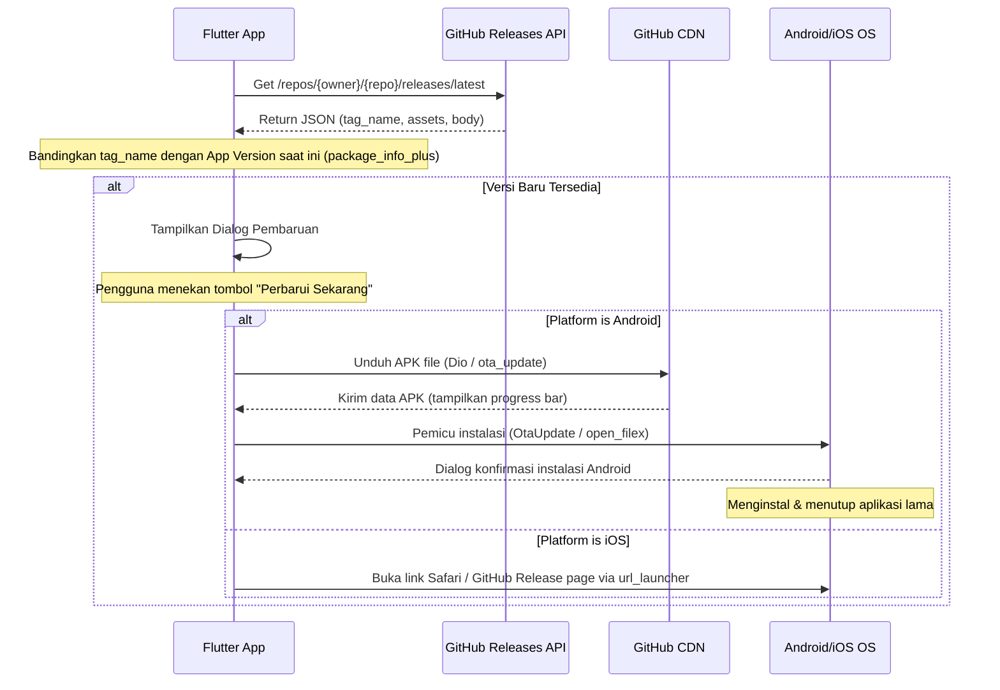

# Panduan Auto-Update Aplikasi Flutter via GitHub Releases

Dokumen ini menjelaskan kelayakan teknis, batasan platform (Android & iOS), serta langkah-langkah implementasi untuk mendeteksi pembaruan versi dari GitHub Releases, mengunduhnya, dan memicu proses instalasi secara langsung di dalam aplikasi.

---

## 1. Kelayakan & Batasan Platform (Feasibility & Platform Constraints)

Proses pembaruan otomatis tanpa melalui toko aplikasi resmi (Google Play Store / Apple App Store) memiliki karakteristik dan batasan keamanan yang sangat berbeda antara Android dan iOS:

### 🟢 Android (Sangat Memungkinkan dengan Konfirmasi)
* **Cara Kerja**: Aplikasi dapat mendeteksi versi baru, mengunduh file APK dari GitHub, dan menggunakan package manager internal Android untuk membuka file APK tersebut guna melakukan update.
* **Keamanan/Izin**: Aplikasi **wajib** meminta izin khusus `REQUEST_INSTALL_PACKAGES`.
* **Proses Instalasi**: Tidak bisa dilakukan secara **silent** (tanpa interaksi sama sekali) pada perangkat standar (non-root/non-MDM). Sistem Android akan memunculkan dialog konfirmasi instalasi: *"Apakah Anda ingin menginstal pembaruan untuk aplikasi yang ada?"*.
* **Restart Otomatis**: Ketika sistem menginstal pembaruan, sistem Android akan menghentikan (terminate) aplikasi lama untuk menimpanya dengan aplikasi baru. Pengguna biasanya harus menekan tombol **"Buka"** pada dialog sukses installer Android.

### 🔴 iOS (Sangat Dibatasi oleh Sandbox Apple)
* **Batasan Utama**: iOS memiliki *sandbox* yang sangat ketat. Anda **tidak dapat** mengunduh file `.ipa` secara acak di latar belakang lalu menginstalnya langsung dari dalam kode aplikasi pada perangkat iOS standar (non-jailbreak).
* **Solusi OTA (Over-The-Air) Resmi**: Menggunakan protokol `itms-services` dengan memanggil tautan plist manifest yang di-host pada HTTPS (misal: `itms-services://?action=download-manifest&url=https://your-domain.com/manifest.plist`). Namun, cara ini memiliki kendala besar:
  1. File `.ipa` harus ditandatangani menggunakan **Apple Enterprise Program** ($299/tahun) atau UDID perangkat pengguna harus didaftarkan dalam profil **Ad-Hoc Provisioning** milik pengembang.
  2. Masih memerlukan interaksi pengguna (konfirmasi dari sistem iOS).
  3. Aplikasi tidak akan restart otomatis; aplikasi akan tertutup untuk proses instalasi di Home Screen, lalu pengguna harus membukanya secara manual.
* **Pendekatan Terbaik untuk iOS (GitHub Release)**: Tampilkan pop-up informasi pembaruan di aplikasi, lalu arahkan pengguna ke halaman GitHub Release menggunakan `url_launcher` untuk petunjuk instalasi manual (misal melalui AltStore, SideStore, atau TrollStore).

---

## 2. Arsitektur Alur Update (Update Flow Architecture)



---

## 3. Langkah Implementasi (Step-by-Step Implementation)

### Langkah 1: Tambahkan Dependencies pada `pubspec.yaml`
Gunakan package `ota_update` untuk Android guna menangani unduhan dan instalasi secara bersamaan, serta `package_info_plus` (yang sudah terpasang) untuk mendeteksi versi lokal.

```yaml
dependencies:
  package_info_plus: ^9.0.1
  dio: ^5.9.2 # Untuk HTTP requests ke GitHub API jika diperlukan
  ota_update: ^5.1.0 # Untuk download & install APK di Android
  url_launcher: ^6.3.1 # Untuk membuka browser di iOS
```

### Langkah 2: Konfigurasi Izin Android (`AndroidManifest.xml`)
Buka file [AndroidManifest.xml](file:///e:/Projek/projek_vibecode/tonztoon_komik/frontend/android/app/src/main/AndroidManifest.xml) dan tambahkan izin berikut sebelum tag `<application>` untuk mengizinkan aplikasi memicu installer:

```xml
<manifest xmlns:android="http://schemas.android.com/apk/res/android">
    <!-- Izin untuk menginstal paket aplikasi pihak ketiga -->
    <uses-permission android:name="android.permission.REQUEST_INSTALL_PACKAGES" />
    <uses-permission android:name="android.permission.INTERNET"/>
    ...
```

> [!WARNING]
> Izin `REQUEST_INSTALL_PACKAGES` dianggap sensitif oleh Google Play Store. Karena aplikasi ini **tidak** di-publish di Play Store (hanya di GitHub), Anda bebas menggunakannya tanpa kendala blokir kebijakan Google Play Console.

---

## 4. Contoh Kode Implementasi di Flutter

Berikut adalah implementasi service untuk mendeteksi pembaruan dan menginstalnya:

### 1. Deteksi Versi & Pembaruan (`update_service.dart`)

```dart
import 'dart:io';
import 'package:dio/dio.dart';
import 'package:package_info_plus/package_info_plus.dart';
import 'package:pub_semver/pub_semver.dart';

class GitHubReleaseModel {
  final String tagName;
  final String description;
  final String apkDownloadUrl;

  GitHubReleaseModel({
    required this.tagName,
    required this.description,
    required this.apkDownloadUrl,
  });

  factory GitHubReleaseModel.fromJson(Map<String, dynamic> json) {
    // Cari asset dengan ekstensi .apk
    final assets = json['assets'] as List<dynamic>? ?? [];
    String apkUrl = '';
    for (var asset in assets) {
      final name = asset['name'] as String? ?? '';
      if (name.endsWith('.apk')) {
        apkUrl = asset['browser_download_url'] as String? ?? '';
        break;
      }
    }

    return GitHubReleaseModel(
      tagName: json['tag_name'] as String? ?? '',
      description: json['body'] as String? ?? '',
      apkDownloadUrl: apkUrl,
    );
  }
}

class UpdateService {
  final _dio = Dio();
  final String githubRepoPath = "username/repository_name"; // Ganti dengan repo Anda

  Future<GitHubReleaseModel?> checkForUpdates() async {
    try {
      final response = await _dio.get(
        'https://api.github.com/repos/$githubRepoPath/releases/latest',
      );

      if (response.statusCode == 200) {
        final release = GitHubReleaseModel.fromJson(response.data);
        
        // Dapatkan versi aplikasi saat ini
        final packageInfo = await PackageInfo.fromPlatform();
        final currentVersion = Version.parse(packageInfo.version);
        
        // Bersihkan tag name dari huruf 'v' (misal: v1.12.0 -> 1.12.0)
        final cleanTagName = release.tagName.replaceAll(RegExp(r'[a-zA-Z]'), '');
        final latestVersion = Version.parse(cleanTagName);

        // Jika versi terbaru lebih tinggi dari versi saat ini
        if (latestVersion > currentVersion) {
          return release;
        }
      }
    } catch (e) {
      // Log error atau abaikan
      print("Gagal memeriksa pembaruan: $e");
    }
    return null;
  }
}
```

### 2. Proses Unduhan & Eksekusi Instalasi (Android)

Menggunakan package `ota_update` untuk memantau progress unduhan dan memicu installer Android:

```dart
import 'package:ota_update/ota_update.dart';

class UpdateExecutor {
  static void runAndroidUpdate({
    required String apkUrl,
    required Function(OtaStatus status, int? progress) onProgress,
    required Function(String error) onError,
  }) {
    try {
      OtaUpdate()
          .execute(
            apkUrl,
            valueName: "TonzToon_Update.apk", // Nama file sementara
          )
          .listen(
        (OtaEvent event) {
          switch (event.status) {
            case OtaStatus.DOWNLOADING:
              final progress = int.tryParse(event.value ?? '0');
              onProgress(OtaStatus.DOWNLOADING, progress);
              break;
            case OtaStatus.INSTALLING:
              onProgress(OtaStatus.INSTALLING, 100);
              break;
            case OtaStatus.ALREADY_UP_TO_DATE:
              onProgress(OtaStatus.ALREADY_UP_TO_DATE, null);
              break;
            default:
              // Menangani case OtaStatus.PERMISSION_NOT_GRANTED_ERROR, CHECKSUM_ERROR, dll.
              onError("Gagal menginstal: ${event.status}");
          }
        },
        onError: (err) {
          onError("Gagal melakukan unduhan: $err");
        },
      );
    } catch (e) {
      onError("Terjadi kesalahan sistem: $e");
    }
  }
}
```

---

## 5. UI/UX Dialog Pembaruan yang Premium

Agar pengalaman pengguna terasa premium dan aman, buatlah dialog pembaruan dengan animasi halus, visual yang modern (glassmorphism/custom card), detail perubahan (release notes), serta visual progress bar yang interaktif.

### Sketsa Dialog UI Pembaruan di Flutter:
```dart
import 'package:flutter/material.dart';
import 'package:ota_update/ota_update.dart';
import 'package:url_launcher/url_launcher.dart';
import 'dart:io';

class UpdateDialog extends StatefulWidget {
  final GitHubReleaseModel release;

  const UpdateDialog({super.key, required this.release});

  @override
  State<UpdateDialog> createState() => _UpdateDialogState();
}

class _UpdateDialogState extends State<UpdateDialog> {
  bool _isDownloading = false;
  double _progress = 0.0;
  String _statusText = "";

  void _startUpdate() {
    if (Platform.isAndroid) {
      setState(() {
        _isDownloading = true;
        _statusText = "Mengunduh pembaruan...";
      });

      UpdateExecutor.runAndroidUpdate(
        apkUrl: widget.release.apkDownloadUrl,
        onProgress: (status, progress) {
          setState(() {
            if (status == OtaStatus.DOWNLOADING) {
              _progress = (progress ?? 0) / 100;
              _statusText = "Mengunduh: ${progress}%";
            } else if (status == OtaStatus.INSTALLING) {
              _statusText = "Menyiapkan instalasi...";
            }
          });
        },
        onError: (error) {
          setState(() {
            _isDownloading = false;
            _statusText = error;
          });
          // Tampilkan snackbar error
        },
      );
    } else if (Platform.isIOS) {
      // Buka halaman rilis di Safari
      launchUrl(
        Uri.parse("https://github.com/username/repository_name/releases"),
        mode: LaunchMode.externalApplication,
      );
    }
  }

  @override
  Widget build(BuildContext context) {
    final theme = Theme.of(context);
    final colorScheme = theme.colorScheme;

    return Dialog(
      shape: RoundedRectangleBorder(borderRadius: BorderRadius.circular(24)),
      elevation: 8,
      backgroundColor: colorScheme.surface,
      child: Padding(
        padding: const EdgeInsets.all(24.0),
        child: Column(
          mainAxisSize: MainAxisSize.min,
          crossAxisAlignment: CrossAxisAlignment.stretch,
          children: [
            // Header Animasi/Icon
            Center(
              child: CircleAvatar(
                radius: 36,
                backgroundColor: colorScheme.primaryContainer,
                child: Icon(
                  Icons.system_update_rounded,
                  size: 40,
                  color: colorScheme.primary,
                ),
              ),
            ),
            const SizedBox(height: 18),
            Text(
              "Versi Baru Tersedia!",
              textAlign: TextAlign.center,
              style: theme.textTheme.titleLarge?.copyWith(fontWeight: FontWeight.bold),
            ),
            const SizedBox(height: 4),
            Text(
              "Versi ${widget.release.tagName} kini siap diunduh.",
              textAlign: TextAlign.center,
              style: theme.textTheme.bodyMedium?.copyWith(color: colorScheme.onSurfaceVariant),
            ),
            const SizedBox(height: 16),
            
            // Catatan Rilis / Release Notes (Bisa Scroll)
            Container(
              maxHeight: 120,
              padding: const EdgeInsets.all(12),
              decoration: BoxDecoration(
                color: colorScheme.surfaceContainerHighest.withValues(alpha: 0.5),
                borderRadius: BorderRadius.circular(12),
              ),
              child: Scrollbar(
                child: SingleChildScrollView(
                  child: Text(
                    widget.release.description.isNotEmpty 
                        ? widget.release.description 
                        : "Perbaikan bug dan peningkatan performa.",
                    style: theme.textTheme.bodySmall,
                  ),
                ),
              ),
            ),
            const SizedBox(height: 24),
            
            // Area Progress atau Tombol Aksi
            if (_isDownloading) ...[
              Column(
                children: [
                  LinearProgressIndicator(
                    value: _progress,
                    borderRadius: BorderRadius.circular(8),
                    minHeight: 8,
                  ),
                  const SizedBox(height: 8),
                  Text(
                    _statusText,
                    style: theme.textTheme.bodySmall?.copyWith(fontWeight: FontWeight.bold),
                  ),
                ],
              )
            ] else ...[
              Row(
                mainAxisAlignment: MainAxisAlignment.end,
                children: [
                  TextButton(
                    onPressed: () => Navigator.pop(context),
                    child: const Text("Nanti Saja"),
                  ),
                  const SizedBox(width: 8),
                  ElevatedButton(
                    onPressed: _startUpdate,
                    style: ElevatedButton.styleFrom(
                      shape: RoundedRectangleBorder(borderRadius: BorderRadius.circular(12)),
                    ),
                    child: const Text("Perbarui Sekarang"),
                  ),
                ],
              ),
            ],
          ],
        ),
      ),
    );
  }
}
```

---

## 6. Ringkasan & Rekomendasi Alur Auto-Update
1. **Trigger Pengecekan**: Jalankan `checkForUpdates()` saat aplikasi pertama kali dibuka (di `main.dart` setelah inisialisasi) atau tambahkan opsi **"Periksa Pembaruan"** di halaman [settings_screen.dart](file:///e:/Projek/projek_vibecode/tonztoon_komik/frontend/lib/src/features/settings/settings_screen.dart).
2. **Kenyamanan Pengguna**: Jangan memaksa update secara agresif kecuali jika ada update yang bersifat kritikal (misalnya perubahan API backend yang merusak versi lama). Berikan pilihan "Nanti Saja" untuk pembaruan minor.
